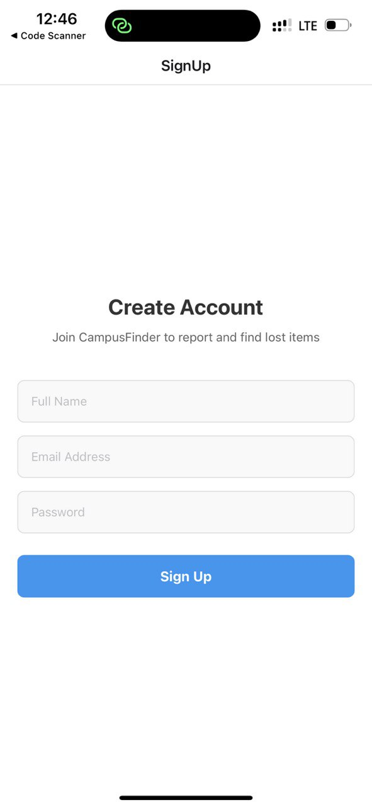
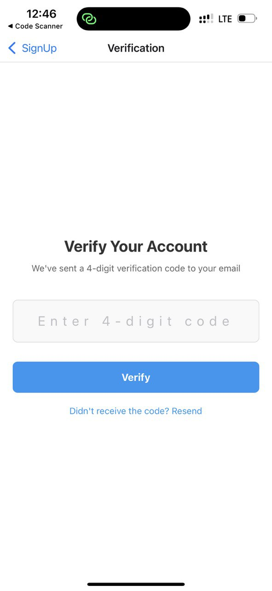
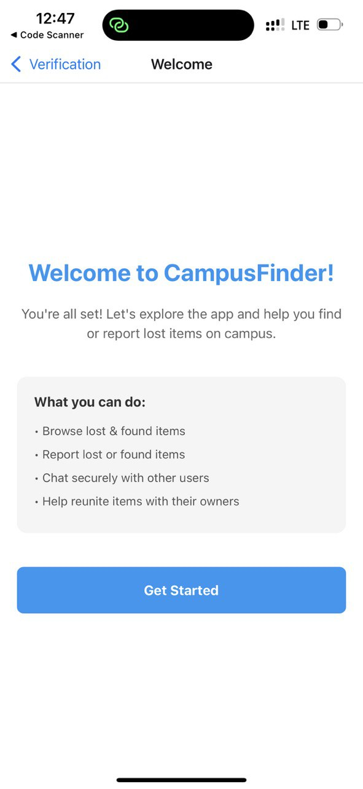
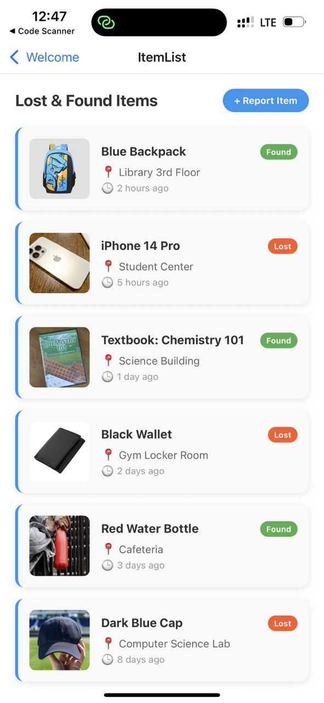
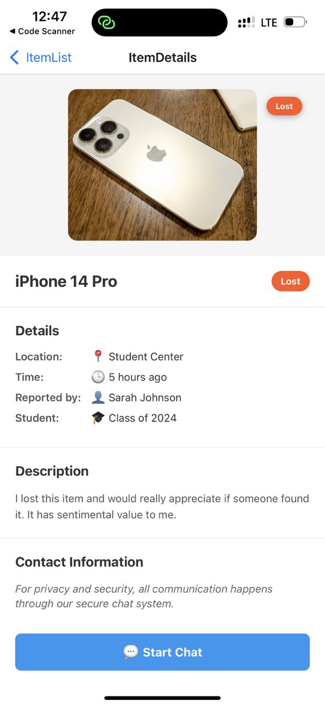
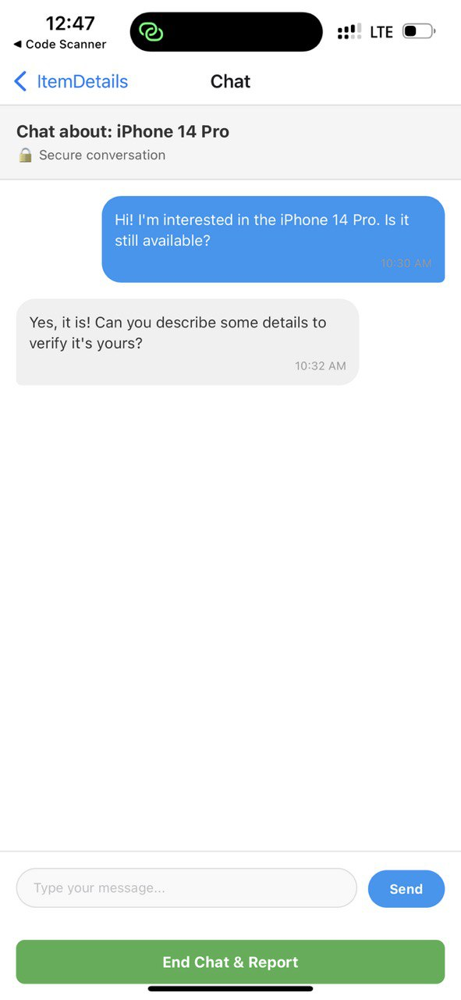
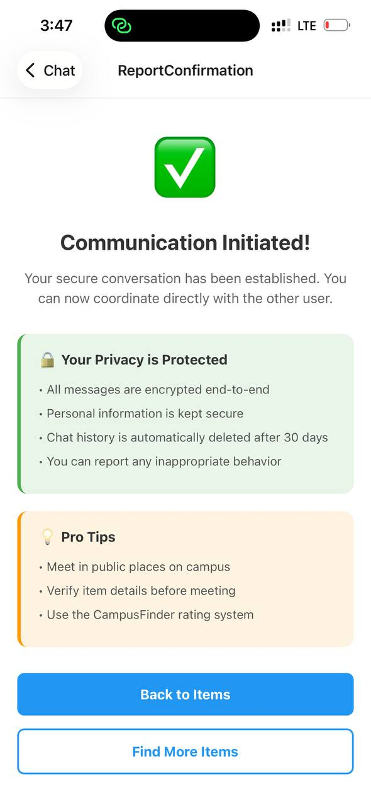
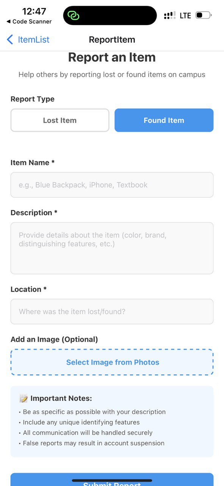

# CampusFinder 🎓📱

## 👨‍💻 Developer Information

**Developer**: Theodore Gyaqueh Abbey  
**Institution**: University of Ghana, Legon  
**Student ID**: 11343393  
**Email**: theodoreabbey174@gmail.com   
**LinkedIn**: www.linkedin.com/in/theodore-abbey   
**GitHub**: theodoreabbey173    
**Program**: Computer Science  
**Academic Year**: 2026  

---

A mobile application designed to help students at University of Ghana Legon report, find, and communicate about lost & found items on campus.


## 📋 About The Project

CampusFinder is a comprehensive lost and found solution specifically designed for university students. The app provides a secure platform where students can report lost items, browse found items, and communicate safely with other users to reunite items with their rightful owners.

### Key Features

- **Item Reporting System**: Easy-to-use forms for reporting both lost and found items
- **Visual Item Browse**: Browse items with images and detailed descriptions
- **Secure Communication**: End-to-end encrypted chat system for user safety
- **User Authentication**: Secure sign-up and verification process
- **Location-Based Tracking**: Items are categorized by campus locations
- **Real-time Updates**: Stay updated on new items and messages

## 🏗️ App Architecture

The application follows three main user flows:

### 1. Sign Up & Onboarding Flow
- **SignUp Screen**: User registration with name, email, and password
- **Verification Screen**: 4-digit email verification code input
- **Welcome Screen**: App introduction and feature overview

### 2. Lost & Found Reporting Flow
- **Item List Screen**: Display all reported items with images and filters
- **Item Details Screen**: Comprehensive item information and contact options
- **Report Item Screen**: Form to report new lost or found items

### 3. Secure Communication Flow
- **Chat Screen**: Encrypted messaging between users
- **Report Confirmation Screen**: Communication success confirmation with safety tips

## 🛠️ Tools & Technologies Used

### Frontend Framework
- **React Native**: Cross-platform mobile development framework
- **Expo Go**: Development platform for React Native applications

### Navigation
- **@react-navigation/native**: Primary navigation library
- **@react-navigation/native-stack**: Stack-based navigation system

### Development Environment
- **JavaScript ES6+**: Modern JavaScript features and syntax
- **React Hooks**: useState for state management
- **StyleSheet**: React Native's built-in styling system

### Design & UI
- **Custom UI Components**: Handcrafted components for optimal user experience
- **Responsive Design**: Adaptive layouts for different screen sizes
- **Image Support**: Local and remote image handling capabilities

## 📱 Screenshots
The process is illustrated beginning on the left side of the diagram.
<div align="center" style="display: flex; justify-content: center; gap: 10px;">








</div>


## 🚀 Getting Started

### Prerequisites

- Node.js (v14 or higher)
- npm or yarn package manager
- Expo CLI
- Expo Go app on your mobile device

### Installation

1. **Clone the repository**
   ```bash
   git clone https://github.com/yourusername/campusfinder.git
   cd campusfinder
   ```

2. **Install dependencies**
   ```bash
   npm install
   # or
   yarn install
   ```

3. **Install navigation dependencies**
   ```bash
   npm install @react-navigation/native @react-navigation/native-stack
   npx expo install react-native-screens react-native-safe-area-context
   ```

4. **Start the development server**
   ```bash
   npx expo start
   ```

5. **Run on device**
   - Scan the QR code with Expo Go app (Android)
   - Scan with Camera app (iOS)

## 📂 Project Structure

```
CampusFinder/
├── App.js                          # Main navigation setup
├── assets
│   
├── screens/
│   ├── screenshots/               # App screenshots
│   ├── SignUpScreen.js            # User registration
│   ├── VerificationScreen.js      # Email verification
│   ├── WelcomeScreen.js           # App welcome & onboarding
│   ├── ItemListScreen.js          # Browse all items
│   ├── ItemDetailsScreen.js       # Individual item details
│   ├── ReportItemScreen.js        # Report new items
│   ├── ChatScreen.js              # Secure messaging
│   └── ReportConfirmationScreen.js # Success confirmation
├── package.json
└── README.md
```


## 🔐 Security Features

- **Encrypted Communication**: All messages are secured
- **Privacy Protection**: User information is kept confidential
- **Safe Meeting Guidelines**: In-app safety tips for user meetings
- **Report System**: Users can report inappropriate behavior

## 🎯 Future Enhancements

- [ ] Push notifications for new matches
- [ ] Advanced search and filtering options
- [ ] User rating and feedback system
- [ ] Integration with university security
- [ ] Multi-language support
- [ ] Dark mode theme
- [ ] Offline capability

## 🐛 Known Issues

- Images may take time to load on slower connections
- Chat requires active internet connection
- Some features optimized for Android (testing on iOS recommended)

## 🤝 Contributing

Contributions are welcome! Please feel free to submit a Pull Request.

1. Fork the project
2. Create your feature branch (`git checkout -b feature/AmazingFeature`)
3. Commit your changes (`git commit -m 'Add some AmazingFeature'`)
4. Push to the branch (`git push origin feature/AmazingFeature`)
5. Open a Pull Request

## 📞 Support

If you encounter any issues or have questions:

- Create an issue on GitHub
- Contact the developer (details above)
- Check the documentation

---

*Built with ❤️ for the University of Ghana community by Theodore Gyaqueh Abbey*
