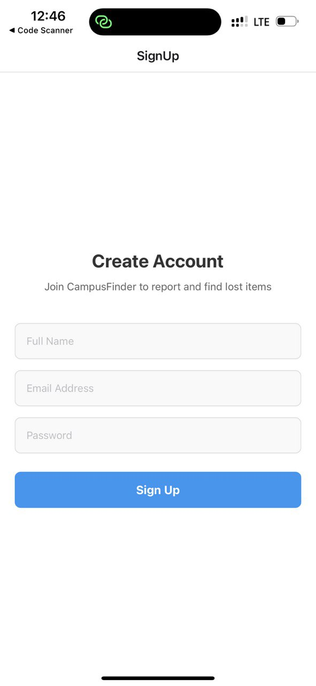
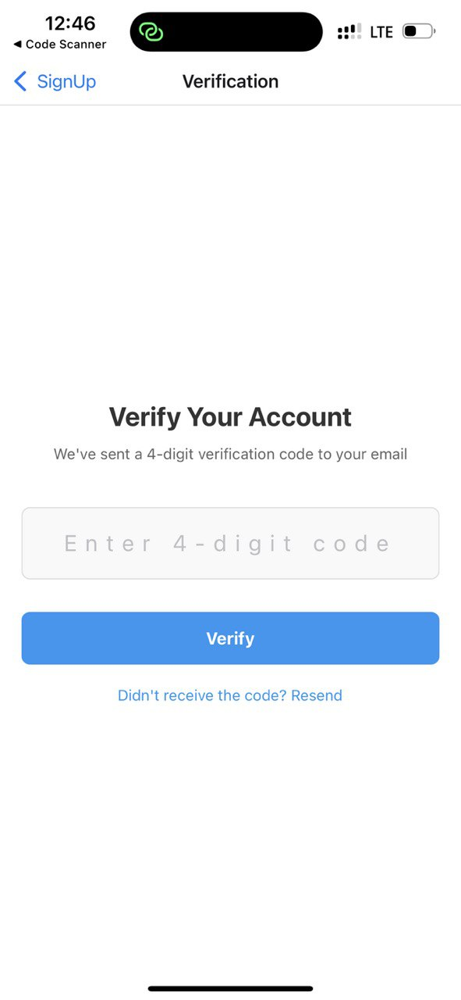
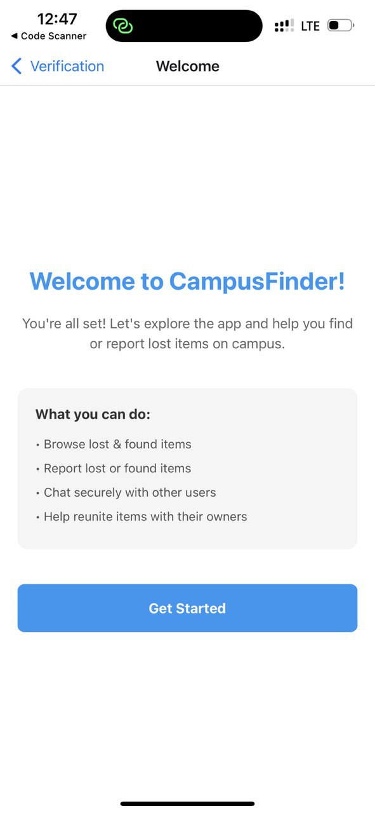
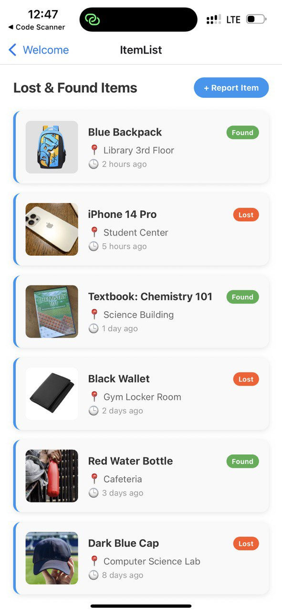
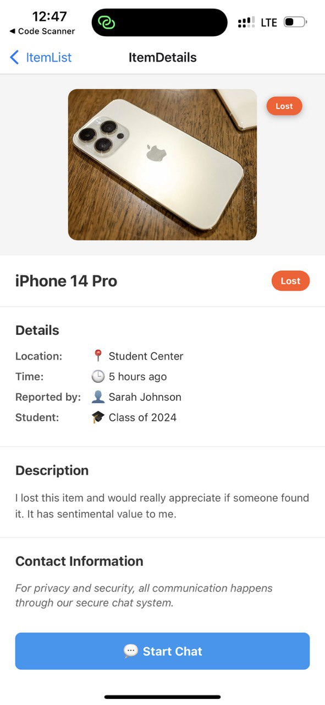
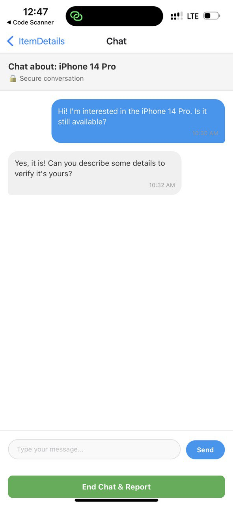
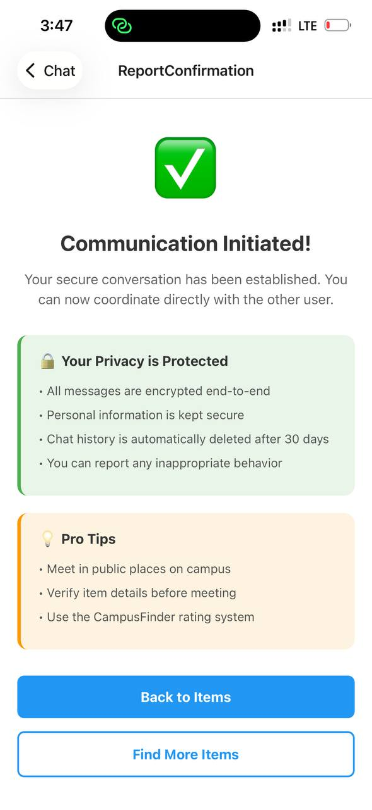
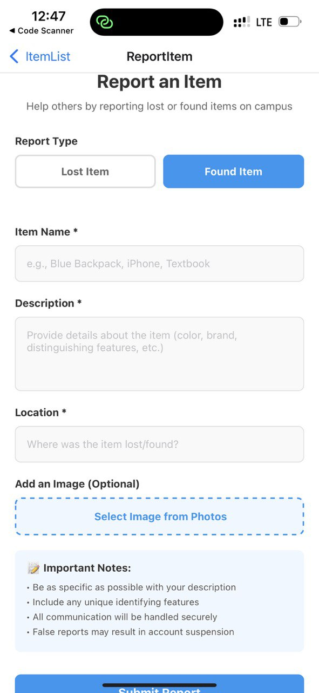

# CampusFinder 🎓📱

## 👨‍💻 Developer Information

**Developer**: Theodore Gyaqueh Abbey  
**Institution**: University of Ghana, Legon    
**Email**: theodoreabbey174@gmail.com   
**LinkedIn**: www.linkedin.com/in/theodore-abbey   
**GitHub**: theodoreabbey173    
**Program**: Computer Science  
**Academic Year**: 2026  

---

A mobile application designed to help students at University of Ghana Legon report, find, and communicate about lost & found items on campus.


## 📋 About The Project

CampusFinder is a comprehensive lost and found solution specifically designed for university students. The app provides a secure platform where students can report lost items, browse found items, and communicate safely with other users to reunite items with their rightful owners.

### Key Features

- **Item Reporting System**: Easy-to-use forms for reporting both lost and found items with image upload
- **Visual Item Browse**: Browse items with images, live Lost/Found stats, search, and filters
- **Secure Communication**: Encrypted chat system for user safety
- **User Authentication**: Firebase-backed sign-up, login, and email verification
- **Inbox / Chat Management**: Centralised inbox to view and manage all active conversations
- **Account / Profile Tab**: View profile info, reported items count, and account settings
- **Location-Based Tracking**: Items are categorised by campus locations
- **Push Notifications**: Stay updated on new items and messages
- **Real-time Updates**: Firebase-powered live data syncing
- **Icon-Based UI**: Consistent `lucide-react-native` iconography throughout — no emoji in the app UI

## 🏗️ App Architecture

The application follows three main user flows:

### 1. Sign Up & Onboarding Flow
- **SignUp Screen**: User registration with name, email, and password
- **Login Screen**: Existing user sign-in
- **Verification Screen**: 4-digit email verification code input
- **Welcome Screen**: App introduction and feature overview

> Firebase Auth state determines the initial route automatically:
> - Not signed in → Auth screens (SignUp / Login)
> - Signed in but email unverified → Verification screen
> - Signed in & verified → Full app

### 2. Main App (Bottom Tabs)
`MainTabs.js` hosts three tabs, each backed by a dedicated screen:
- **Browse** (`ListScreen`): Live Lost/Found stats, search, filter pills, and a floating **+ Report** button
- **Chats** (`InboxScreen`): Overview of all active chat conversations
- **You** (`ProfileScreen`): Account info, reported items, and settings

### 3. Lost & Found Reporting Flow
- **Details Screen**: Comprehensive item information and contact options
- **Report Item Screen**: Form to report new lost or found items with image picker
- **Confirmation Screen**: Report submission success confirmation with safety tips

### 4. Secure Communication Flow
- **Chat Screen**: Encrypted real-time messaging between users, launched from Browse or Chats

## 🛠️ Tools & Technologies Used

### Frontend Framework
- **React Native**: Cross-platform mobile development framework
- **Expo**: Development platform including image picker and push notifications

### Backend & Database
- **Firebase**: Authentication, real-time database, and cloud storage
- **firebase/auth**: `onIdTokenChanged` listener for live auth state management

### Navigation
- **@react-navigation/native**: Primary navigation library
- **@react-navigation/native-stack**: Stack-based navigation for auth and detail screens
- **@react-navigation/bottom-tabs**: Bottom tab navigation for the main app (Browse / Chats / You)

### Storage & Security
- **AsyncStorage**: Local persistent storage (`@react-native-async-storage/async-storage`)
- **CryptoJS**: Client-side message encryption

### Development Environment
- **JavaScript ES6+**: Modern JavaScript features and syntax
- **React Hooks**: `useState`, `useEffect` for state and lifecycle management
- **StyleSheet**: React Native's built-in styling system

### Design & UI
- **Custom UI Components**: Handcrafted components for optimal user experience
- **lucide-react-native**: Consistent icon set used across every screen (no emoji in the UI)
- **Responsive Design**: Adaptive layouts for different screen sizes
- **expo-image-picker**: Native image selection for item reports

## 📱 Screenshots
The process is illustrated beginning on the left side of the diagram.
<div align="center" style="display: flex; justify-content: center; gap: 10px;">








</div>


## 🚀 Getting Started

### Prerequisites

- Node.js (v14 or higher)
- npm or yarn package manager
- Expo CLI
- Expo Go app on your mobile device
- A Firebase project (Authentication + Firestore/Realtime Database enabled)

### Installation

1. **Clone the repository**
   ```bash
   git clone https://github.com/theodoreabbey173/CampusFinder.git
   cd CampusFinder
   ```

2. **Install dependencies**
   ```bash
   npm install
   ```

3. **Configure Firebase**  
   Create a `firebaseConfig.js` file in the project root and add your Firebase project credentials:
   ```js
   import { initializeApp } from 'firebase/app';
   import { getAuth } from 'firebase/auth';

   const firebaseConfig = {
     apiKey: "YOUR_API_KEY",
     authDomain: "YOUR_AUTH_DOMAIN",
     projectId: "YOUR_PROJECT_ID",
     storageBucket: "YOUR_STORAGE_BUCKET",
     messagingSenderId: "YOUR_MESSAGING_SENDER_ID",
     appId: "YOUR_APP_ID"
   };

   const app = initializeApp(firebaseConfig);
   export const auth = getAuth(app);
   ```

4. **Start the development server**
   ```bash
   npx expo start
   ```

5. **Run on device**
   - Scan the QR code with Expo Go app (Android)
   - Scan with Camera app (iOS)

## 📂 Project Structure

```
CampusFinder/
├── App.js                          # Main navigation setup & Firebase auth listener
├── firebaseConfig.js               # Firebase project configuration
├── index.js                        # App entry point
├── assets/                         # App icons, splash screen, and images
├── backend/
│   ├── authService.js              # Sign up / login / verification helpers
│   ├── chatService.js              # Chat creation, messaging, subscriptions
│   ├── itemsService.js             # Lost & found item CRUD + subscriptions
│   ├── notificationService.js      # Push notification registration & badges
│   └── storageService.js           # Firebase Storage image uploads
├── components/
│   └── LucideIconExample.js        # Reference usage of lucide-react-native icons
├── screens/
│   ├── screenshots/                # App screenshots
│   ├── SignUpScreen.js             # User registration
│   ├── LoginScreen.js              # User sign-in
│   ├── VerificationScreen.js       # Email verification
│   ├── WelcomeScreen.js            # App welcome & onboarding
│   ├── MainTabs.js                 # Bottom tab navigator (Browse / Chats / You)
│   ├── ListScreen.js               # Browse tab — item list, search, filters, + Report
│   ├── DetailsScreen.js            # Individual item details
│   ├── ReportItemScreen.js         # Report new items (with image picker)
│   ├── InboxScreen.js              # Chats tab — all active chat conversations
│   ├── ChatScreen.js               # Secure real-time messaging
│   ├── ProfileScreen.js            # You tab — account info & settings
│   └── ConfirmationScreen.js       # Report submission success
├── package.json
└── README.md
```


## 🔐 Security Features

- **Firebase Authentication**: Secure email/password auth with email verification gate
- **Encrypted Communication**: Messages secured with CryptoJS before transmission
- **Privacy Protection**: User information is kept confidential
- **Safe Meeting Guidelines**: In-app safety tips for user meetings
- **Report System**: Users can report inappropriate behaviour

## 🎯 Future Enhancements

- [ ] Push notifications for new matches
- [ ] Advanced search and filtering options
- [ ] User rating and feedback system
- [ ] Integration with university security
- [ ] Multi-language support
- [ ] Dark mode theme
- [ ] Offline capability

## 🐛 Known Issues

- Images may take time to load on slower connections
- Chat requires active internet connection
- Some features optimised for Android (testing on iOS recommended)

## 🤝 Contributing

Contributions are welcome! Please feel free to submit a Pull Request.

1. Fork the project
2. Create your feature branch (`git checkout -b feature/AmazingFeature`)
3. Commit your changes (`git commit -m 'Add some AmazingFeature'`)
4. Push to the branch (`git push origin feature/AmazingFeature`)
5. Open a Pull Request

## 📞 Support

If you encounter any issues or have questions:

- Create an issue on GitHub
- Contact the developer (details above)
- Check the documentation

---

*Built with ❤️ for the University of Ghana community by Theodore Gyaqueh Abbey*
